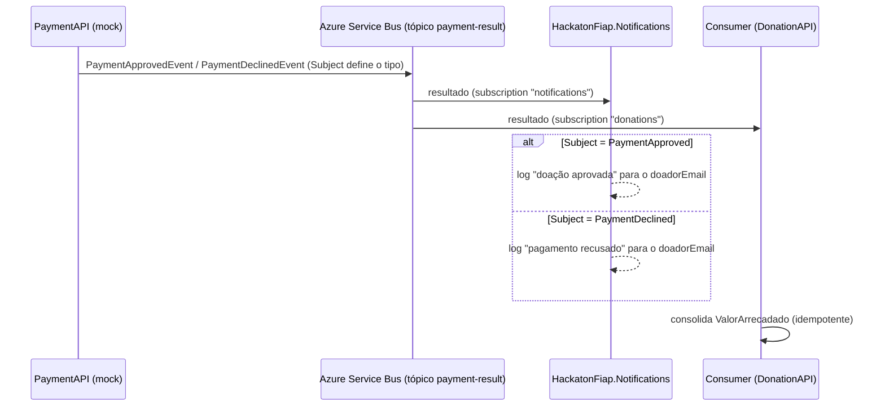

# HackatonFiap.Notifications — NotificationFunction

**NotificationFunction** da plataforma **Conexão Solidária** (Hackathon FIAP). Reage ao resultado do pagamento de uma doação e **notifica o doador** (aprovado ou recusado). No MVP o canal é **mock/log** (log estruturado + Application Insights), coerente com o gateway de pagamento simulado — **sem** provedor externo de email/SMS. Implementa o **PRD-07 — Notificações**.

**Azure Function isolated worker (.NET 8)** acionada por **trigger de Azure Service Bus** no tópico `payment-result`, subscription `notifications` — **independente** da subscription `donations` do consumer da DonationAPI. Uma falha aqui **não** afeta a consolidação do `ValorArrecadado` (RN07.3).

> **Ecossistema (6 repos):** `notifications` (este) · `users` · `donations` · `payments` · `front` · `orchestration`. Mapa completo no [orchestration](https://github.com/GabrielVeridico/hackaton-fiap-orchestration#-ecossistema).

## Escolhas
- **Azure Function gerenciada, fora do AKS** — é um subdomínio de apoio, orientado a evento; serverless com scale-to-zero e trigger nativo de Service Bus.
- **Subscription própria** (pub/sub) — permite ser um 2º consumidor independente do resultado, sem competir com o consumer de arrecadação.
- **Eventos enriquecidos** (`DonorEmail`/`DonorName`) — notifica **sem** chamar a UserAPI.

## Fluxo de notificações



## Contrato consumido
A PaymentAPI publica no tópico `payment-result` distinguindo o tipo pelo **`Subject`** da mensagem (corpo JSON em PascalCase).

| Subject | Evento | Campos |
|---------|--------|--------|
| `PaymentApproved` | `PaymentApprovedEvent` | `DonationId, CampaignId, Amount, PaymentId, DonorId, DonorEmail, DonorName` |
| `PaymentDeclined` | `PaymentDeclinedEvent` | `DonationId, CampaignId, Reason, Amount, DonorId, DonorEmail, DonorName` |

Subject desconhecido/ausente ou corpo inválido → *warning* e a mensagem é concluída (sem reentrega infinita). Entrega *at-least-once*: reprocessar pode gerar log duplicado — aceitável no MVP (RN07.6).

## Como rodar localmente
Pré-requisitos: **.NET 8 SDK** + **Azure Functions Core Tools** (`func`).

```bash
dotnet build HackatonFiap.Notifications.sln
dotnet test  HackatonFiap.Notifications.sln         # xUnit + NSubstitute + FluentAssertions

cd src/HackatonFiap.Notifications
cp local.settings.example.json local.settings.json  # preencha SERVICEBUS_CONNECTION
func start
```
Ambiente completo (saga + Service Bus emulado) em [orchestration/local](https://github.com/GabrielVeridico/hackaton-fiap-orchestration/tree/master/local).

### Configuração
| Variável | Descrição |
|----------|-----------|
| `SERVICEBUS_CONNECTION` | Connection string do Service Bus (obrigatório) |
| `APPLICATIONINSIGHTS_CONNECTION_STRING` | Application Insights (desabilitado se vazio) |

O tópico (`payment-result`) e a subscription (`notifications`) estão no atributo `ServiceBusTrigger`, alinhados ao publisher da PaymentAPI.

## CI/CD
`.github/workflows/ci-cd.yml` (GitHub Actions): a cada push/PR na `main` → **build + testes** (sempre, sem secrets). O job de **deploy é opcional/gated** por `vars.DEPLOY_ENABLED == 'true'` — a CI passa verde sem credenciais Azure.

## Deploy
É uma **Azure Function** (não container/AKS). Deploy gerenciado via `azure/functions-action` para a Function App **`func-conexao-notifications-7xafxr`** (gated no CI), ou manualmente:
```bash
func azure functionapp publish func-conexao-notifications-7xafxr
```
Runbook completo em [orchestration/iac/DEPLOY-AZURE.md](https://github.com/GabrielVeridico/hackaton-fiap-orchestration/blob/master/iac/DEPLOY-AZURE.md) (§3).

## Observabilidade
Serilog (Console + Application Insights); logs estruturados com `ServiceName: HackatonFiap.Notifications`. Por rodar **fora do AKS**, métricas/logs vão para **Application Insights / Azure Monitor** (não para o Prometheus/Grafana in-cluster).

## Arquitetura
```
src/HackatonFiap.Notifications/
├── Functions/PaymentResultNotificationFunction.cs   # ServiceBusTrigger (tópico + subscription)
├── Processing/PaymentNotificationProcessor.cs        # roteia por Subject + desserializa (testável)
├── Notifying/{IDonorNotifier,LogDonorNotifier}.cs     # canal de notificação (abstração + mock/log)
├── Events/{PaymentApproved,PaymentDeclined}Event.cs   # espelham o contrato da PaymentAPI
└── Program.cs · host.json · Dockerfile
tests/HackatonFiap.Notifications.UnitTests/
```
