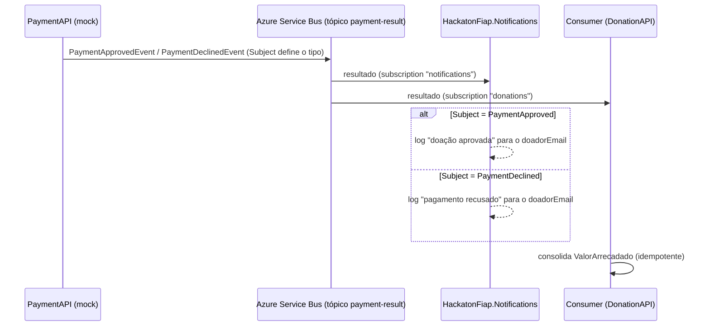

# HackatonFiap.Notifications

NotificationFunction do projeto **Conexão Solidária** (Hackathon FIAP). Reage ao resultado do
processamento de pagamento de uma doação e **notifica o doador** (aprovado ou recusado). No MVP o
canal é **mock/log** (registro em log estruturado + Application Insights), coerente com o gateway de
pagamento simulado — **sem** provedor externo de email/SMS. Implementa o [[PRD-07 — Notificações]].

Azure Function isolated worker (.NET 8) acionada por um **trigger de Azure Service Bus** sobre o
tópico `payment-result`, consumindo a subscription `notifications` — **independente** da subscription
`donations` usada pelo consumer da DonationAPI. Uma falha aqui não afeta a consolidação do
`ValorArrecadado` (RN07.3).

## Fluxo de notificações



## Contrato consumido

A PaymentAPI publica no tópico `payment-result` distinguindo o tipo pelo **`Subject`** da mensagem
(não há campo de status no corpo). O corpo é JSON em PascalCase.

| Subject | Evento | Campos |
|---------|--------|--------|
| `PaymentApproved` | `PaymentApprovedEvent` | `DonationId, CampaignId, Amount, PaymentId, DonorId, DonorEmail, DonorName` |
| `PaymentDeclined` | `PaymentDeclinedEvent` | `DonationId, CampaignId, Reason, Amount, DonorId, DonorEmail, DonorName` |

Subject desconhecido/ausente ou corpo inválido geram um *warning* e a mensagem é concluída (sem
reentrega infinita). Entrega *at-least-once*: reprocessar o mesmo evento pode gerar log duplicado —
aceitável no MVP (RN07.6).

## Arquitetura

```
src/HackatonFiap.Notifications/
├── Functions/
│   └── PaymentResultNotificationFunction.cs   # ServiceBusTrigger (tópico + subscription)
├── Processing/
│   └── PaymentNotificationProcessor.cs         # roteia por Subject e desserializa (lógica testável)
├── Notifying/
│   ├── IDonorNotifier.cs                        # canal de notificação (abstração)
│   └── LogDonorNotifier.cs                      # implementação mock/log
├── Events/
│   ├── PaymentApprovedEvent.cs                  # espelha o contrato da PaymentAPI
│   └── PaymentDeclinedEvent.cs
├── Program.cs                                   # startup (Serilog + Application Insights + DI)
├── host.json
├── appsettings.json
├── local.settings.example.json                 # modelo p/ rodar localmente
└── Dockerfile
tests/HackatonFiap.Notifications.UnitTests/
└── PaymentNotificationProcessorTests.cs         # xUnit + NSubstitute + FluentAssertions
```

## Configuração

| Variável | Descrição | Padrão |
|----------|-----------|--------|
| `SERVICEBUS_CONNECTION` | Connection string do Azure Service Bus | (obrigatório) |
| `APPLICATIONINSIGHTS_CONNECTION_STRING` | Application Insights | (desabilitado se vazio) |

O nome do tópico (`payment-result`) e da subscription (`notifications`) estão no atributo
`ServiceBusTrigger` da Function, alinhados ao publisher da PaymentAPI.

## Build, testes e execução

```bash
# Build + testes
dotnet build HackatonFiap.Notifications.sln
dotnet test HackatonFiap.Notifications.sln

# Rodar a Function localmente (requer Azure Functions Core Tools)
cd src/HackatonFiap.Notifications
cp local.settings.example.json local.settings.json   # preencha SERVICEBUS_CONNECTION
func start
```

## Docker

```bash
docker build -f src/HackatonFiap.Notifications/Dockerfile -t hackaton-fiap-notifications .
docker run \
  -e SERVICEBUS_CONNECTION="Endpoint=sb://..." \
  hackaton-fiap-notifications
```

## Observabilidade

- **Serilog** com sinks para Console e Application Insights.
- Logs estruturados com `ServiceName: HackatonFiap.Notifications`.
- Por rodar fora do AKS, métricas/logs vão para **Application Insights / Azure Monitor** (não para o
  Prometheus/Grafana in-cluster).

## Tecnologias

- .NET 8.0
- Azure Functions (isolated worker) + Azure Service Bus (tópico/subscription)
- Serilog + Application Insights
- xUnit + NSubstitute + FluentAssertions
