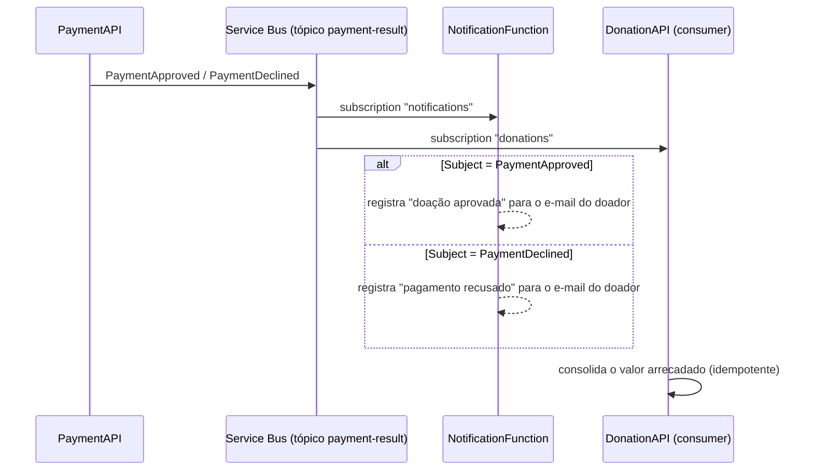

# HackatonFiap.Notifications — NotificationFunction

Componente de notificação da plataforma **Conexão Solidária** (Hackathon FIAP PosTech). Reage ao resultado do pagamento de uma doação e avisa o doador, tenha ele sido aprovado ou recusado. É uma **Azure Function** disparada por evento do Service Bus — não expõe API REST de negócio.

> **Ecossistema (6 repositórios):** `notifications` (este) · `users` · `donations` · `payments` · `front` · `orchestration`. Mapa completo no [orchestration](https://github.com/GabrielVeridico/hackaton-fiap-orchestration#ecossistema).

## Stack

| Item | Escolha |
|------|---------|
| Runtime | Azure Functions v4, **isolated worker**, .NET 8 |
| Gatilho | `ServiceBusTrigger` no tópico `payment-result`, subscription `notifications` |
| Canal de notificação | `LogDonorNotifier` — log estruturado, sem provedor externo de e-mail ou SMS |
| Observabilidade | Serilog (console + Application Insights) |
| Testes | xUnit + NSubstitute + FluentAssertions |

Três decisões explicam o formato deste componente:

- **Function gerenciada, fora do AKS.** É um subdomínio de apoio, puramente reativo. Serverless com scale-to-zero e trigger nativo de Service Bus custa menos e tem menos peças móveis do que um pod dedicado.
- **Subscription própria.** No modelo pub/sub, esta função é um segundo consumidor independente do mesmo tópico. Ela não compete com o consumer de arrecadação da DonationAPI.
- **Canal mock.** O gateway de pagamento também é simulado; um provedor real de e-mail não acrescentaria nada à demonstração da arquitetura. A abstração `IDonorNotifier` isola a troca.

## Papel no fluxo



As duas subscriptions são independentes. Uma falha aqui **não** afeta a consolidação do valor arrecadado pela DonationAPI.

### Contrato consumido

A PaymentAPI distingue o tipo do evento pelo **`Subject`** da mensagem; o corpo é JSON em PascalCase e não carrega campo de status.

| Subject | Evento | Campos |
|---------|--------|--------|
| `PaymentApproved` | `PaymentApprovedEvent` | `DonationId, CampaignId, Amount, PaymentId, DonorId, DonorEmail, DonorName` |
| `PaymentDeclined` | `PaymentDeclinedEvent` | `DonationId, CampaignId, Reason, Amount, DonorId, DonorEmail, DonorName` |

Como os eventos já trazem o identificador e o e-mail do doador, a função notifica sem consultar a UserAPI. O campo `DonorName` faz parte do contrato mas chega vazio no MVP — o JWT emitido pela UserAPI não tem claim de nome.

Tratamento de mensagem inválida: `Subject` ausente ou desconhecido, corpo vazio e JSON malformado geram um *warning* e a mensagem é concluída — não há reentrega infinita nem dead-letter por payload inválido. A entrega é *at-least-once*, então um reprocessamento pode gerar log duplicado; no escopo desta entrega isso é aceitável, porque a notificação não altera estado.

## Endpoints

Não há endpoint REST de negócio: o único ponto de entrada é o gatilho de Service Bus descrito acima. A saúde e as métricas do componente são observadas pelo **Application Insights**, não por `/health` ou `/metrics` — a função roda fora do cluster e, portanto, fora do alcance do Prometheus.

## Como rodar localmente

Pré-requisitos: **.NET 8 SDK** e **Azure Functions Core Tools** (`func`).

```bash
dotnet build HackatonFiap.Notifications.sln

cd src/HackatonFiap.Notifications
cp local.settings.example.json local.settings.json   # preencha SERVICEBUS_CONNECTION
func start
```

O arquivo `local.settings.json` não é versionado. Para exercitar a saga completa com o Service Bus emulado, use [orchestration/local](https://github.com/GabrielVeridico/hackaton-fiap-orchestration/tree/master/local) — lá a função sobe já conectada ao emulador e ao Azurite.

### Docker

```bash
docker build -t hackatonfiap-notifications:local -f src/HackatonFiap.Notifications/Dockerfile .
```

## Configuração

Os valores vêm de `local.settings.json` no desenvolvimento e das *application settings* da Function App em produção.

| Variável | Obrigatória | Descrição |
|----------|-------------|-----------|
| `SERVICEBUS_CONNECTION` | sim | Connection string do Service Bus. É o nome referenciado no atributo `ServiceBusTrigger` |
| `AzureWebJobsStorage` | sim | Storage do runtime de Functions. Localmente, `UseDevelopmentStorage=true` (Azurite) |
| `FUNCTIONS_WORKER_RUNTIME` | sim | `dotnet-isolated` |
| `APPLICATIONINSIGHTS_CONNECTION_STRING` | não | Telemetria; o sink fica desabilitado quando vazio |

O tópico (`payment-result`) e a subscription (`notifications`) estão fixos no atributo `ServiceBusTrigger`, alinhados ao publisher da PaymentAPI.

## Testes

```bash
dotnet test HackatonFiap.Notifications.sln
```

Os testes cobrem o `PaymentNotificationProcessor`: roteamento por `Subject`, desserialização dos dois eventos e o descarte silencioso de mensagens com `Subject` desconhecido, corpo vazio ou JSON inválido. O processador foi separado da função justamente para ser testável sem o host de Functions.

## CI/CD

`.github/workflows/ci-cd.yml`. A cada push ou pull request na `main`, e sob `workflow_dispatch`:

- **Job `ci`** — `dotnet restore`, `build` e `test`. Roda sempre, sem depender de nenhum segredo.
- **Job `cd`** — condicionado a `vars.DEPLOY_ENABLED == 'true'`. Sem essa variável o pipeline fecha verde só com a CI.

O deploy faz login federado por **OIDC**, publica o pacote com `azure/functions-action` (plano Flex Consumption, o que exige `sku: flexconsumption` na action) e depois **verifica** que a Function App ficou em estado `Running` com pelo menos uma função registrada — a action sozinha pode reportar sucesso com o host em crash-loop.

Para publicar manualmente:

```bash
# descubra o nome da Function App do ambiente
az functionapp list -g hackaton-fiap --query "[].name" -o tsv

func azure functionapp publish <nome-da-function-app>
```

Runbook completo em [orchestration/iac/DEPLOY-AZURE.md](https://github.com/GabrielVeridico/hackaton-fiap-orchestration/blob/master/iac/DEPLOY-AZURE.md).

## Estrutura de pastas

```
src/HackatonFiap.Notifications/
├── Functions/PaymentResultNotificationFunction.cs   # ServiceBusTrigger (tópico + subscription)
├── Processing/PaymentNotificationProcessor.cs       # roteia por Subject e desserializa
├── Notifying/                                       # IDonorNotifier + LogDonorNotifier
├── Events/                                          # espelham o contrato publicado pela PaymentAPI
└── Program.cs · host.json · Dockerfile
tests/
└── HackatonFiap.Notifications.UnitTests/
```
